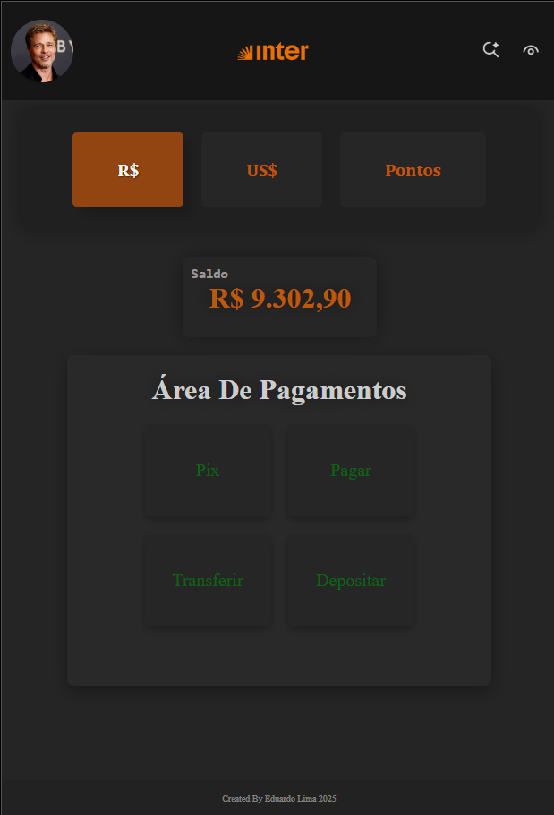

# Banco de Teste

Interface estática inicial de um banco digital fictício.

## Funcionalidades
- Página inicial com informações do banco.
- Páginas separadas para diferentes regiões (BR e US).
- Página de pontos do cliente.
- Estilização com CSS.

## Tecnologias utilizadas
- HTML5
- CSS3

## Estrutura do projeto
```
Banco-De-Teste/
│
├── imgs/          # Imagens do projeto
├── br.html        # Página versão Brasil
├── us.html        # Página versão Estados Unidos
├── pontos.html    # Página de pontos
├── style.css      # Arquivo de estilos
└── README.md      # Documentação
```

## Pré-visualização


## Como executar
1. Baixe ou clone este repositório:
   ```bash
   git clone https://github.com/edulimaC/Banco-De-Teste.git
   ```
2. Abra qualquer arquivo `.html` no seu navegador.
